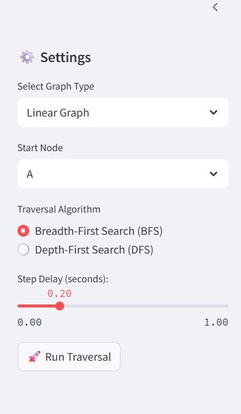
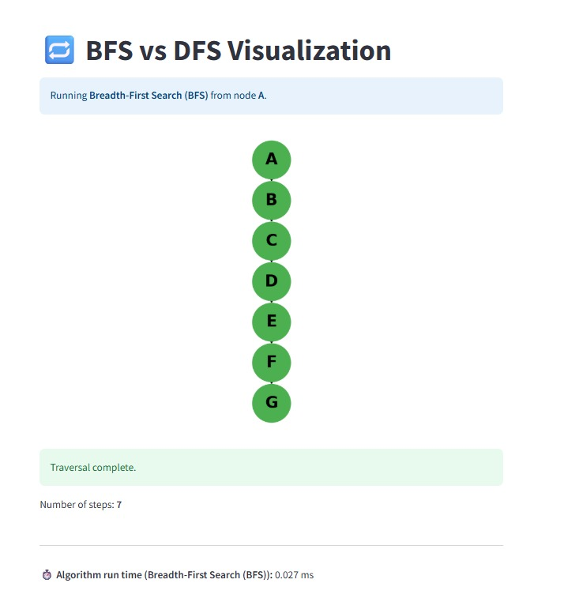
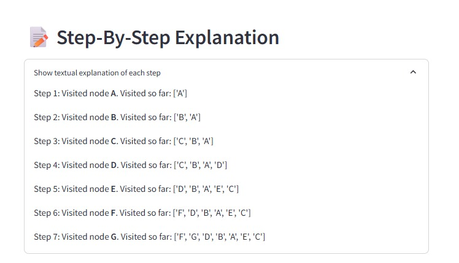
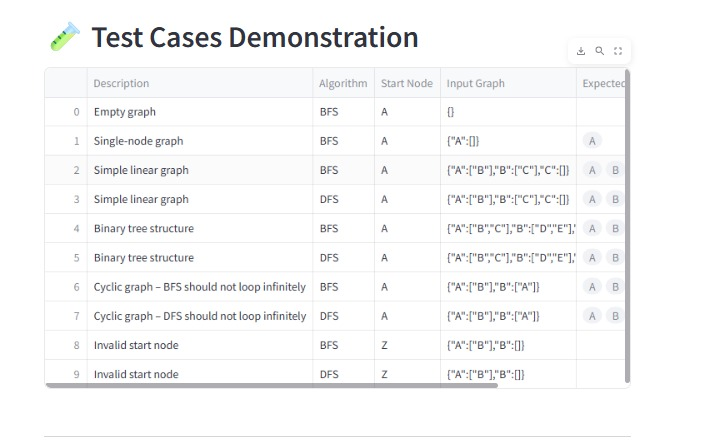
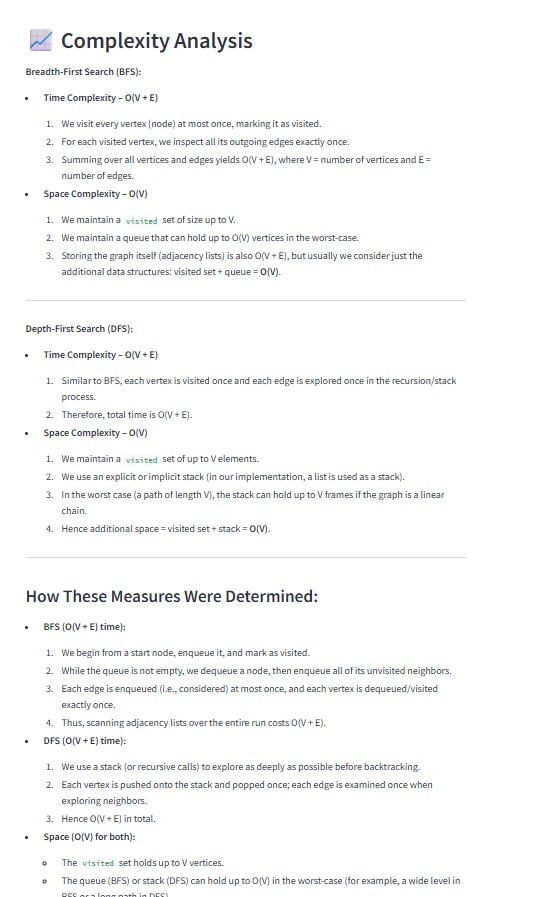

````markdown
# BFS vs DFS Visualizer

**Streamlit Web-App URL:**  
[https://your-deployment-url.herokuapp.com](https://your-deployment-url.herokuapp.com)  

---

## Description

The **BFS vs DFS Visualizer** is a Streamlit-based web application that demonstrates and compares two fundamental graph traversal algorithms:

- **Breadth-First Search (BFS)**
- **Depth-First Search (DFS)**

With this tool, users can:

- Choose from several predefined graph types (Linear Graph, Binary Tree, Tree with Uneven Depths, Directed Graph, Cyclic Graph).  
- Select a starting node for traversal.  
- Pick either BFS or DFS as the traversal algorithm.  
- Adjust the animation speed (delay between steps).  
- Watch an animated, step-by-step visualization of node visits on the graph (nodes turn green as they are visited).  
- View a textual explanation describing which node is visited at each step.  
- Run a suite of predefined test cases (including edge cases) and see immediate “Pass”/“Fail” results in a table.  
- Read a detailed **Complexity Analysis** section (Big O notation) for both BFS and DFS.

This project is intended for educational purposes—students and developers can visualize how BFS and DFS explore nodes and verify correctness across multiple scenarios.

---

## Table of Contents

1. [Installation](#installation)  
2. [Usage](#usage)  
3. [Features](#features)  
4. [Project Structure](#project-structure)  
5. [Examples / Screenshots](#examples--screenshots)  
6. [Test Cases](#test-cases)  
7. [Complexity Analysis](#complexity-analysis)  
8. [Contributing](#contributing)  
9. [License](#license)  
10. [References](#references)

---

## Installation

### Prerequisites

- Python 3.8 or higher  
- pip (Python package installer)

### Steps

1. **Clone the repository**  
   ```bash
   git clone https://github.com/yourusername/bfs-dfs-visualizer.git
   cd bfs-dfs-visualizer
````

2. **(Optional) Create and activate a virtual environment**

   ```bash
   python3 -m venv venv
   source venv/bin/activate     # macOS/Linux  
   venv\Scripts\activate        # Windows
   ```

3. **Install dependencies**

   ```bash
   pip install -r requirements.txt
   ```

   The `requirements.txt` includes:

   * `streamlit>=1.20.0`
   * `networkx>=2.8.0`
   * `matplotlib>=3.7.0`
   * `pandas>=2.0.0`

---

## Usage

### Run the Streamlit App Locally

```bash
streamlit run app.py
```

* By default, the app will open at [http://localhost:8501](http://localhost:8501).
* If it doesn’t open automatically, navigate there manually.

### Deployment

To deploy on a hosting service (e.g., Streamlit Cloud, Heroku):

1. Push your repository to GitHub.
2. Connect the GitHub repo to your hosting platform.
3. Ensure `requirements.txt` (and `Procfile`, if needed) are present.
4. The hosting service will install dependencies and deploy the app.

---

## Features

* **Graph Selection**: Choose from Linear Graph, Binary Tree, Tree with Uneven Depths, Directed Graph, or Cyclic Graph.
* **Start Node**: Pick any existing node as the starting point.
* **Algorithm Choice**: Select either Breadth-First Search (BFS) or Depth-First Search (DFS).
* **Animation Speed**: Adjust the delay (in seconds) between each visualization step.
* **Animated Traversal**: Watch nodes highlight in green as they are visited, step by step.
* **Textual Explanation**: See a list of steps, e.g., “Step 3: Visited node C. Visited so far: \[A, B, C].”
* **Test Cases**: Run a predefined suite of test cases covering normal, edge, and special scenarios; results are shown as “Pass”/“Fail.”
* **Complexity Analysis**: View Big O time and space complexity for both BFS and DFS.

---

## Project Structure

```
.
├── app.py              # Main Streamlit application
├── algorithm.py        # BFS and DFS implementations with step logging
├── utils.py            # Helper functions (graph constructors, plotting)
├── test_algorithm.py   # Unit tests / test-case definitions for BFS and DFS
├── requirements.txt    # Python dependencies
├── LICENSE             # MIT License text
└── README.md           # This documentation file
└── images/             # Folder containing all screenshots
    ├── settings_panel.png
    ├── main_visualization.png
    ├── textual_explanation.png
    ├── test_cases_table.png
    └── complexity_analysis.png
```

---

## Examples / Screenshots

*(Place these image files inside the `images/` folder at the project root.)*

1. **Settings Panel**
   
   *Select graph type, start node, algorithm (BFS/DFS), and step delay.*

2. **Main Visualization**
   
   *Sample frame showing node “C” highlighted in green, indicating it has been visited.*

3. **Textual Step-by-Step Explanation**
   
   *Collapsed expander listing lines like “Step 1: Visited node A. Visited so far: \[A].”*

4. **Test Cases Demonstration Table**
   
   *Predefined test cases with input graphs, expected visit orders, actual visit orders, and “Pass”/“Fail.”*

5. **Complexity Analysis Section**
   
   *Detailed Big O time (O(V + E)) and space (O(V)) complexities for BFS and DFS.*

---

## Test Cases

The application includes a variety of test cases to demonstrate algorithm behavior under different conditions:

* **Empty Graph**

  ```python
  graph = {}
  start = "A"
  algorithm = "BFS"
  expected = []
  ```

* **Single-Node Graph**

  ```python
  graph = {"A": []}
  start = "A"
  algorithm = "BFS"
  expected = ["A"]
  ```

* **Simple Linear Graph (BFS)**

  ```python
  graph = {"A": ["B"], "B": ["C"], "C": []}
  start = "A"
  algorithm = "BFS"
  expected = ["A", "B", "C"]
  ```

* **Simple Linear Graph (DFS)**

  ```python
  graph = {"A": ["B"], "B": ["C"], "C": []}
  start = "A"
  algorithm = "DFS"
  expected = ["A", "B", "C"]
  ```

* **Binary Tree Structure (DFS)**

  ```python
  graph = {
    "A": ["B", "C"],
    "B": ["D", "E"],
    "C": ["F", "G"],
    "D": [], "E": [], "F": [], "G": []
  }
  start = "A"
  algorithm = "DFS"
  expected = ["A", "B", "D", "E", "C", "F", "G"]
  ```

* **Cyclic Graph – DFS Should Not Loop Infinitely**

  ```python
  graph = {"A": ["B"], "B": ["A"]}
  start = "A"
  algorithm = "DFS"
  expected = ["A", "B"]
  ```

* **Invalid Start Node**

  ```python
  graph = {"A": ["B"], "B": []}
  start = "Z"
  algorithm = "BFS"
  expected = []
  ```

*(Full definitions and results are built into `test_algorithm.py` and displayed in the app.)*

---

## Complexity Analysis

### Breadth-First Search (BFS)

* **Time Complexity – O(V + E)**

  1. Each vertex is visited at most once ⇒ O(V).
  2. Each edge is examined exactly once ⇒ O(E).
  3. Total = **O(V + E)**, where V = number of vertices and E = number of edges.

* **Space Complexity – O(V)**

  1. A `visited` set can hold up to V vertices.
  2. A queue can hold up to O(V) vertices in the worst case.
  3. Auxiliary structures (visited set + queue) sum to **O(V)**.

### Depth-First Search (DFS)

* **Time Complexity – O(V + E)**

  1. Each vertex is pushed onto and popped from the stack exactly once ⇒ O(V).
  2. Each edge is explored at most once ⇒ O(E).
  3. Total = **O(V + E)**.

* **Space Complexity – O(V)**

  1. A `visited` set can hold up to V vertices.
  2. The recursion stack (or explicit stack) can grow up to size V in the worst case (e.g., a linear chain).
  3. Additional auxiliary space = **O(V)**.

> **Note:** In both BFS and DFS, we ignore the storage used by the input graph itself (adjacency lists, which is O(V + E)) when discussing auxiliary space.

---

## Contributing

1. Fork the repository.
2. Create a new branch:

   ```bash
   git checkout -b feature/your-feature-name
   ```
3. Make your changes and commit:

   ```bash
   git commit -m "Describe your changes"
   ```
4. Push to your branch:

   ```bash
   git push origin feature/your-feature-name
   ```
5. Open a Pull Request and describe your improvements.

---

## License

This project is licensed under the MIT License.
See the [LICENSE](LICENSE) file for details.

---

## References

* **Graph Traversal**

  * Cormen, T. H., Leiserson, C. E., Rivest, R. L., & Stein, C. (2009). *Introduction to Algorithms* (3rd ed.), Chapters 22–23.
  * Wikipedia: [Breadth-First Search](https://en.wikipedia.org/wiki/Breadth-first_search), [Depth-First Search](https://en.wikipedia.org/wiki/Depth-first_search)

* **Streamlit Documentation**

  * [Streamlit Docs](https://docs.streamlit.io)

* **NetworkX Documentation**

  * [NetworkX Official Site](https://networkx.org/documentation/stable/)

* **Matplotlib / Seaborn**

  * [Matplotlib](https://matplotlib.org)
  * [Seaborn](https://seaborn.pydata.org)

* **Pandas Documentation**

  * [Pandas Docs](https://pandas.pydata.org/docs/)

```
```
